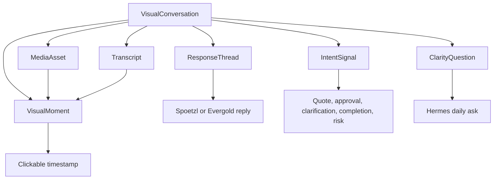

# Spoetzl x Evergold Visual Collaboration Master Plan

Date: April 26, 2026

## North Star

Build a mobile-first visual collaboration and clarity platform where Evergold and Spoetzl can turn landscape vision, field walks, proposals, approvals, and daily work into a shared source of truth.

The product is not just a media gallery. It is a visual conversation system:

- Evergold records what it sees, recommends, or completed.
- Spoetzl reviews, responds, clarifies, approves, or asks for revision.
- The app stores every photo, video, screenshot, transcript, response, and extracted visual moment in the right project context.
- Hermes turns the exchange into cited clarity questions, alignment observations, and proposed memory updates.
- Honcho becomes the long-term relationship memory layer only after reviewed evidence is ready to write.

## Current Baseline

The app is already live at:

https://spoetzl-brewery-app.vercel.app

Current strengths:

- Desktop home has a Clarity Board structure.
- Mobile home is readable and thumb-friendly.
- Global media capture exists for photos/videos.
- Media can be attached to zones, walkthroughs, work logs, proposals, approvals, or the project board.
- Contextual media galleries exist on maps, work logs, walkthroughs, proposal detail, videos, and field captures.
- Hermes already has a local, cited memory surface for static project data.

Current gaps:

- Main board needs real visual thumbnails, not only styled cards.
- Laptop camera, screenshots, and screen recording are not implemented.
- Media metadata is stored as JSON files in Supabase Storage; that will become brittle for transcripts, moments, threads, and search.
- Walkthroughs do not yet have a detail page with player, transcript, moments, and response thread.
- Hermes does not ingest dynamic media, transcripts, responses, or visual moments.
- Honcho is not wired for real writeback.
- Several pages remain text-heavy: proposals, plans, clarity, specifications, vision, enhancements, and dashboard.

## Product Model

The main object is a `VisualConversation`.

Examples:

- Evergold walkthrough interpreting a request for quote.
- Evergold completion assessment for a phase.
- Spoetzl response video to a proposed design direction.
- Tom attaching reference images and explaining which parts matter.
- Donna marking a visual issue and asking for approval or clarification.

Core records:

- `MediaAsset`: photo, camera video, uploaded video, screenshot, screen recording, concept image, document.
- `VisualConversation`: grouped collaboration event tied to a zone, walkthrough, proposal, approval, work log, or project-wide board.
- `Transcript`: full text plus timecoded speech segments.
- `VisualMoment`: key video moment, screenshot, crop, or annotation linked to transcript text.
- `ResponseThread`: Tom, Donna, Spoetzl, or Evergold responses by text, audio, video, or image.
- `IntentSignal`: AI or human-labeled meaning such as quote request, approval, completion review, clarification, issue, constraint, preference.
- `HermesEvent`: cited input that Hermes can read and reason over.
- `MemoryWriteCandidate`: proposed Honcho write, blocked until reviewed.

## Capture Modes

The capture surface should become one shared bottom-sheet/tool:

1. Photo
   - Phone camera.
   - Laptop webcam.
   - File upload.

2. Video
   - Phone camera walkthrough.
   - Laptop webcam response.
   - File upload.

3. Screenshot
   - Browser screen-share permission.
   - Capture one frame from selected screen/window/tab.
   - Optional annotate/crop before save.

4. Screen recording
   - Browser `getDisplayMedia` plus `MediaRecorder`.
   - Optional microphone.
   - Useful for map, estimate, concept board, or proposal walkthroughs.

5. Response capture
   - Record a reply against a specific visual moment.
   - Add image examples and note which parts are relevant.
   - Allow "this part, not that part" annotations.

## Visual UI Direction

Every important page should carry visual proof without becoming noisy.

Visual rules:

- Use square or near-square rounded thumbnails with 8px radius unless existing layout requires larger.
- Thumbnails should hint at the real asset: concept image, before photo, video poster, screenshot, map crop, transcript moment.
- Use progressive disclosure: thumbnail first, drawer/detail next, full transcript/player last.
- Do not bury approvals under text. Approval surfaces need visual evidence before signoff language.
- Mobile primary actions stay in the thumb zone.
- Desktop command board stays single-screen when possible, but should show visual media tiles.

Priority visual additions:

- `/`: visual strip for "Today visual proof" with 4-6 square thumbnails.
- `/proposals`: visual packet preview per proposal card.
- `/clarity`: each clarity gap shows linked evidence thumbnail.
- `/plans`: approval packet has media previews before signoff conditions.
- `/specifications`: acceptance criteria include proof thumbnails.
- `/vision`: inspiration and current-site references sit beside principles.
- `/dashboard`: latest media/moments row.
- `/enhancements`: inline attach media/evidence.

## Build Phases

### Phase 0 - Baseline and Safety

Goal: Preserve current live value while planning deeper changes.

Deliverables:

- Keep current production deploy stable.
- Capture current desktop and mobile screenshots.
- Document routes and media touchpoints.
- Confirm build, lint, audit.

UI checks:

- `/` desktop 1440x900 and 1366x768.
- `/` mobile 390x844 and 430x932.
- `/field-captures`, `/videos`, `/work`, `/maps`, `/proposals/phase-one-arrival`.

### Phase 1 - Visual Board Upgrade

Goal: Make the app visibly about landscape/media collaboration on day one.

Deliverables:

- Add reusable `VisualAssetThumbnail` and `VisualAssetStrip`.
- Add real media thumbnail previews to home board.
- Add visual packet previews to proposals, clarity, plans, specifications, dashboard, vision, and enhancements.
- Use fallback curated images from existing research assets when no user media exists.

UI checks:

- Home desktop still fits as a single Clarity Board.
- Home mobile shows visual proof within first 1-2 scrolls.
- Text does not overlap thumbnails.
- Empty states are useful, not blank.

### Phase 2 - Capture Expansion

Goal: Capture what users actually need from phones and laptops.

Deliverables:

- Add laptop webcam capture via `navigator.mediaDevices.getUserMedia`.
- Add screenshot capture via `navigator.mediaDevices.getDisplayMedia` frame grab.
- Add screen recording via `MediaRecorder`.
- Add capture-source metadata: `phone_camera`, `webcam`, `screen_recording`, `screenshot`, `upload`.
- Add permission and error states.
- Keep mobile bottom-sheet and thumb-zone action layout.

UI checks:

- MacBook/laptop capture modal at desktop widths.
- Mobile capture sheet at 390x844.
- Screenshot permission flow does not trap user.
- Save action remains reachable after keyboard opens.

### Phase 3 - Data Foundation

Goal: Move from JSON metadata to relational media/project records.

Deliverables:

- Add Supabase tables or migration docs for:
  - `media_assets`
  - `visual_conversations`
  - `transcripts`
  - `transcript_segments`
  - `visual_moments`
  - `response_threads`
  - `response_messages`
  - `intent_signals`
  - `hermes_events`
  - `memory_write_candidates`
- Add typed repository helpers.
- Keep JSON storage as a temporary compatibility fallback.
- Add server-side pagination and filtering.

UI checks:

- Existing media still appears.
- New uploads appear in the correct context.
- Filters remain fast and accurate.
- No page depends on a full bucket scan.

### Phase 4 - Walkthrough Detail Experience

Goal: Make each walkthrough a rich, reviewable communication record.

Deliverables:

- Add `/walkthroughs/[id]`.
- Video player with contextual side panel.
- Transcript panel with clickable timestamps.
- Key moments rail with square thumbnails.
- Response thread tied to the whole walkthrough or a specific moment.
- Manual transcript/summary entry first, before automation.

UI checks:

- Tom can open a walkthrough and understand it in under 30 seconds.
- A timestamp click seeks the video.
- A response can be added to a moment.
- Mobile detail page keeps player, moments, and reply controls reachable.

### Phase 5 - Transcript and Visual Moment Automation

Goal: Make uploaded video useful without manual review burden.

Deliverables:

- Add processing state: `uploaded`, `queued`, `transcribing`, `extracting_moments`, `ready`, `needs_review`, `failed`.
- Add speech-to-text endpoint/job.
- Add frame extraction/poster generation.
- Add VLM pass for key visual moments and screenshot selection.
- Add rich transcript with image references and video timestamps.
- Add manual correction UI.

UI checks:

- Processing status is visible and calm.
- Failure states explain next action.
- Transcript segments link to moments.
- Moments do not overwhelm the user.

### Phase 6 - Intent and Clarity Intelligence

Goal: Turn media conversations into aligned project intelligence.

Deliverables:

- Add intent classifier for:
  - quote request
  - approval
  - completion assessment
  - clarification request
  - scope change
  - constraint
  - preference
  - risk/issue
- Add Hermes event reducer.
- Add dynamic Hermes surface endpoint.
- Add cited clarity question generation.
- Add review workflow before project facts change.

UI checks:

- Hermes shows source citations for every claim.
- Clarity questions link back to exact media moment/transcript text.
- Reviewer can approve, reject, or edit a suggested observation.

### Phase 7 - Honcho Memory Writeback

Goal: Store relationship memory only after human-reviewed evidence exists.

Honcho direction:

- Use Honcho's workspace/peer/session/message model for relationship memory.
- Represent Spoetzl, Evergold, Hermes, Donna, and Tom as peers where appropriate.
- Store reviewed interaction summaries and cited project preferences.
- Keep project facts in app storage; use Honcho for relationship, preference, communication style, and recurring alignment patterns.

Deliverables:

- Add `lib/honcho/client.ts`.
- Add `lib/honcho/memory-writes.ts`.
- Add writeback queue with review gates.
- Add "why Hermes thinks this" citations.
- Add environment guardrails.

External references:

- Honcho overview: https://docs.honcho.dev/v2/documentation/introduction/overview
- Honcho architecture: https://docs.honcho.dev/v2/documentation/core-concepts/architecture
- Honcho GitHub: https://github.com/plastic-labs/honcho

UI checks:

- No memory write occurs without reviewer approval.
- Memory status is visible in Hermes.
- Failed writeback does not block normal project workflow.

### Phase 8 - Production Hardening

Goal: Make the platform safe for real client use.

Deliverables:

- Auth/magic links later.
- Role-aware access.
- Upload limits and resumable/direct uploads.
- Delete/restore.
- Audit trail.
- Observability.
- Backups.
- Privacy controls.

UI checks:

- Executive user can review without friction.
- Field user can capture in under 20 seconds.
- No destructive action lacks confirmation.

## Agent Teams

### Team A - Product Orchestration

Mission:

- Keep the north star intact.
- Decide what ships in each phase.
- Resolve ambiguity between "more visual" and "too busy."

Owns:

- This master plan.
- Acceptance criteria.
- Phase sequencing.
- Daily checkpoint summary.

Outputs:

- Phase brief.
- Build priorities.
- Scope cuts when needed.

### Team B - Visual UX Team

Mission:

- Make the app feel like a visual landscaping management platform.

Owns:

- `app/page.tsx`
- visual thumbnail components
- page-level media previews
- mobile thumb-zone patterns
- empty/loading/error states

Work packages:

- Home visual proof strip.
- Visual evidence previews across text-heavy pages.
- Main board desktop fit checks.
- Mobile reachability audit.

Acceptance gates:

- Screenshots pass at desktop and mobile sizes.
- Primary action is visible and reachable.
- Visuals clarify the page instead of decorating it.

### Team C - Capture and Browser Media Team

Mission:

- Let users capture phone media, laptop camera, screenshots, and screen recordings.

Owns:

- `components/camera/CameraCapture.tsx`
- new `components/media-capture/*`
- new `lib/media-capture/*`

Work packages:

- Webcam capture.
- Screenshot capture.
- Screen recording.
- Permission/error states.
- Preview and save workflow.

Acceptance gates:

- Capture mode tested on desktop.
- Mobile capture remains thumb-friendly.
- Save path attaches to correct context.

### Team D - Media Data Platform Team

Mission:

- Move media metadata into real queryable records.

Owns:

- `lib/media-assets.ts`
- `app/api/media-assets/route.ts`
- Supabase schema/migrations
- repository helpers

Work packages:

- DB schema.
- Backward-compatible JSON migration.
- Pagination/filtering.
- update/delete routes.
- thumbnails/poster fields.

Acceptance gates:

- Existing media remains visible.
- New upload round trip passes.
- No major page depends on scanning all files.

### Team E - Walkthrough Conversation Team

Mission:

- Turn walkthroughs into reviewable multi-modal conversation records.

Owns:

- `app/walkthroughs/[id]`
- player/detail drawer
- transcript display
- visual moments rail
- response thread UI

Work packages:

- Walkthrough detail route.
- Video player + timestamp seek.
- Manual transcript and summary.
- Response composer with text/video/image.

Acceptance gates:

- Tom can review a walkthrough and respond.
- Donna can see what Tom responded to.
- Each response has context and citation.

### Team F - Transcript and VLM Processing Team

Mission:

- Convert media into rich, searchable, visual transcripts.

Owns:

- processing API routes
- transcript/moment models
- key frame extraction
- LLM/VLM summaries

Work packages:

- Processing queue model.
- Transcription endpoint.
- Frame extraction.
- Moment generation.
- Rich transcript serialization.

Acceptance gates:

- Transcript segments have timestamps.
- Moment thumbnails are linked to transcript text.
- Video jumps to the correct timestamp.

### Team G - Hermes and Honcho Intelligence Team

Mission:

- Turn reviewed collaboration events into cited clarity intelligence and long-term memory.

Owns:

- `lib/hermes-memory.ts` refactor
- `lib/hermes/*`
- `app/api/hermes/*`
- Honcho adapter

Work packages:

- `HermesEvent` schema.
- Dynamic Hermes reducer.
- Review workflow.
- Memory write candidates.
- Honcho writeback behind guardrails.

Acceptance gates:

- Every Hermes observation has citations.
- Human review gates all memory mutation.
- Honcho failure does not break the app.

### Team H - QA and Browser Verification Team

Mission:

- Check progress in the actual UI after every slice.

Owns:

- browser screenshots
- smoke-test checklist
- live URL verification
- mobile thumb-reach checks

Required checks:

- `npm run build`
- `npm run lint`
- `npm audit --omit=dev`
- desktop screenshots at 1440x900 and 1366x768
- mobile screenshots at 390x844 and 430x932
- capture workflow smoke test
- media appears in correct context
- console/page errors check

## Phase-by-Phase Agent Assignments

### Sprint 1: Visual Proof and Capture Shape

Teams:

- Team B: home thumbnails and visual proof strips.
- Team C: laptop camera, screenshot, screen recording UI shell.
- Team H: UI screenshots and thumb-zone checks.

Do not start:

- Honcho writeback.
- Full automation.
- Complex database migration unless Sprint 1 UI requires a small schema stub.

### Sprint 2: Data Foundation

Teams:

- Team D: schema and repository.
- Team E: walkthrough detail structure.
- Team H: regression checks.

Do not start:

- VLM moment extraction until media records are stable.

### Sprint 3: Walkthrough Conversation

Teams:

- Team E: player, transcript, moments, response thread.
- Team D: transcript/moment/response APIs.
- Team H: real UI checks.

### Sprint 4: Automation

Teams:

- Team F: transcription and visual moment generation.
- Team G: Hermes event ingestion.
- Team H: processing status UI checks.

### Sprint 5: Memory and Intelligence

Teams:

- Team G: dynamic Hermes, review gates, Honcho adapter.
- Team B: clarity/approval visual evidence polish.
- Team H: live verification.

## Standard Agent Contract

Every implementation agent must return:

- Files changed.
- What was added.
- What was intentionally deferred.
- Screens or routes checked.
- Build/lint status.
- Remaining risks.

Every UI-facing change must include:

- Desktop screenshot check.
- Mobile screenshot check.
- Console/page error check.
- At least one workflow interaction check.

## Definition of Done

A phase is done only when:

- It works locally.
- It passes build/lint/audit.
- It is checked in browser on desktop and mobile.
- It is deployed or explicitly held back.
- The live URL is smoke-tested.
- The current repo is committed and pushed.
- The user can test the feature from the main app without hidden setup.

## Immediate Next Build Recommendation

Start with Sprint 1.

Reason:

- It improves the product feel immediately.
- It gives Spoetzl and Evergold more visual confidence before the intelligence layer gets complex.
- It creates the UI slots that later automation can fill.
- It keeps the work grounded in what users can see and touch.

First tasks:

1. Add visual thumbnails to the main Clarity Board.
2. Add a reusable visual evidence strip.
3. Add screenshot and screen recording capture modes to the capture sheet.
4. Add laptop webcam capture.
5. Add browser checks for mobile thumb reach and desktop board fit.
