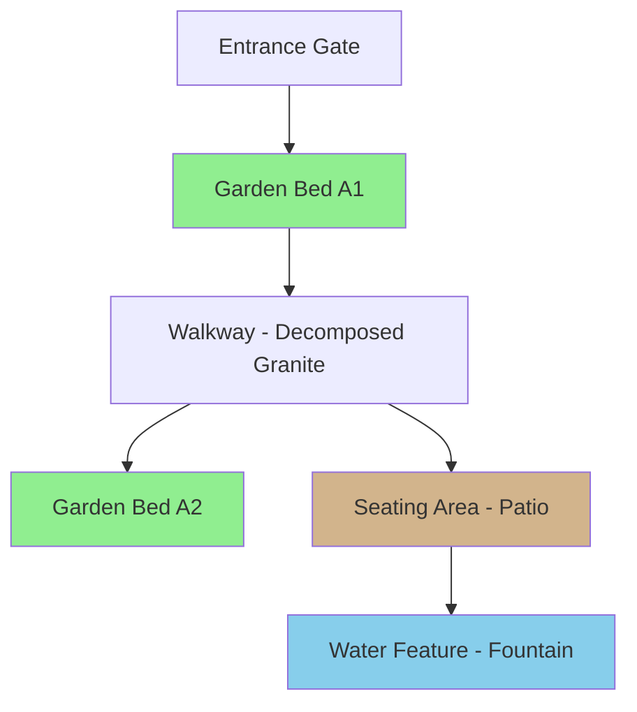

# Design Clarity Engine

## Purpose

**Ambiguity is the enemy of great landscape design.**

This skill transforms complex design concepts into multiple fidelity tiers so that:
- Designers can iterate quickly (low fidelity)
- Contractors can build accurately (medium fidelity)
- Stakeholders can approve confidently (high fidelity)
- Visitors can understand the vision (public-facing)

**All tiers render from the same source data.** Change once, every view updates.

## The Multi-Fidelity Philosophy

Borrowed from FlowStar's clarity approach, adapted for landscape design:

| Tier | Format | Audience | Purpose |
|------|--------|----------|---------|
| Source | Markdown / JSON | System | Raw truth - plant lists, specs, measurements |
| Diagram | Mermaid / ASCII | Designers, agents | Embeddable spatial layouts, plant relationships |
| Visual | HTML/CSS/SVG | Contractors, clients | Interactive site plans, 3D concepts |
| Presentation | Export-ready HTML | Executives, stakeholders | Beautiful, forwardable, print-ready |

## Agent Swarm Approach

This skill orchestrates **multiple agent personas** to generate different fidelity levels:

### 1. Data Structurer (General-Purpose Agent)
**Persona**: Technical writer who organizes information clearly
**Task**: Extract design specifications into structured format
**Output**: Markdown tables, JSON schema for plant lists, hardscape specs

### 2. Diagram Generator (General-Purpose Agent)
**Persona**: Landscape architect creating spatial layouts
**Task**: Generate Mermaid diagrams showing spatial relationships
**Output**: Site plan diagrams, planting bed layouts, irrigation zones

### 3. Visual Designer (General-Purpose Agent)
**Persona**: Web designer creating interactive visualizations
**Task**: Generate HTML/CSS/SVG visual representations
**Output**: Interactive site plans, material palettes, seasonal renderings

### 4. Presentation Builder (General-Purpose Agent)
**Persona**: Marketing professional creating stakeholder materials
**Task**: Generate polished presentation-ready outputs
**Output**: Beautiful HTML exports, PDF-ready layouts, executive summaries

## Fidelity Tier Details

### Tier 1: Source (Markdown/JSON)

Raw specifications that serve as single source of truth:

```markdown
## Garden Bed A1 - Entrance Feature
- **Location**: Main entrance, south-facing
- **Dimensions**: 12' x 8' (96 sq ft)
- **Soil Type**: Amended with compost, well-draining
- **Irrigation**: Drip zone A, 2 GPH emitters
- **Plantings**:
  - 3x Knockout Roses (Red) - focal points
  - 5x Lantana - seasonal color, pollinator friendly
  - 8x Liriope - evergreen border
  - Hardwood mulch 3" depth
- **Hardscape**: Limestone edging, 4" height
```

### Tier 2: Diagram (Mermaid/ASCII)

Spatial relationships and dependencies:



### Tier 3: Visual (Interactive HTML/CSS/SVG)

Generated HTML with interactive elements:
- Click beds to see plant lists
- Toggle seasonal views (spring/summer/fall/winter)
- Show/hide irrigation zones
- Material palette swatches
- Before/after sliders

### Tier 4: Presentation (Export-Ready)

Polished stakeholder presentation:
- Executive summary (30-second overview)
- Key visuals and renderings
- Budget breakdown
- Timeline phases
- Expected outcomes

## Usage Pattern

```bash
# User provides design specifications in any format
# (photo, sketch, description, existing document)

/clarity-engine

# Claude Code will:
# 1. Spawn Data Structurer agent to extract specifications
# 2. Spawn Diagram Generator to create Mermaid layouts
# 3. Spawn Visual Designer to generate interactive HTML
# 4. Spawn Presentation Builder for stakeholder materials
# 5. Save all tiers to project directory with consistent naming
```

## Output Structure

All outputs saved to `project-plans/{project-name}/`:

```
project-plans/entrance-garden-enhancement/
├── source.md                    # Tier 1: Raw specs
├── diagrams/
│   ├── site-layout.mmd         # Mermaid source
│   └── site-layout.svg         # Rendered diagram
├── visual/
│   ├── index.html              # Interactive site plan
│   ├── styles.css
│   └── assets/
├── presentation/
│   ├── stakeholder-deck.html   # Executive presentation
│   └── stakeholder-deck.pdf    # Print-ready version
└── README.md                    # Navigation guide
```

## When to Run

- After completing initial design specifications
- When presenting to stakeholders for approval
- When contractors need build documentation
- When design changes require updated visuals
- For public-facing communication about projects

## Success Criteria

- Eliminates "wait, what did we agree on?" confusion
- Contractors can build without ambiguity
- Stakeholders can visualize outcomes before approval
- Design changes propagate across all fidelity tiers
- No one needs to ask "can you explain this again?"

## Agent Orchestration Pattern

```typescript
// Pseudo-code showing agent swarm pattern
// (Claude Code executes this via Task tool spawning)

async function generateClarityTiers(designInput: string) {
  // Spawn agents in parallel
  const [source, diagrams, visual, presentation] = await Promise.all([
    spawnAgent('general-purpose', {
      persona: 'Data Structurer',
      task: 'Extract specifications to structured markdown',
      input: designInput
    }),
    spawnAgent('general-purpose', {
      persona: 'Diagram Generator',
      task: 'Generate Mermaid spatial layout diagrams',
      input: designInput
    }),
    spawnAgent('general-purpose', {
      persona: 'Visual Designer',
      task: 'Create interactive HTML site plan',
      input: designInput
    }),
    spawnAgent('general-purpose', {
      persona: 'Presentation Builder',
      task: 'Generate stakeholder presentation',
      input: designInput
    })
  ]);

  // Save outputs to structured directory
  await saveToProject({
    source: source.output,
    diagrams: diagrams.output,
    visual: visual.output,
    presentation: presentation.output
  });

  return {
    message: 'All clarity tiers generated',
    location: 'project-plans/{project-name}/'
  };
}
```

## Notes

- This skill does NOT call external LLM APIs
- Uses only Claude Code's built-in Task tool with agent personas
- Agent swarms work in parallel for efficiency
- All outputs are plain HTML/Markdown/SVG (no external dependencies)
- Stakeholders receive self-contained files they can share
